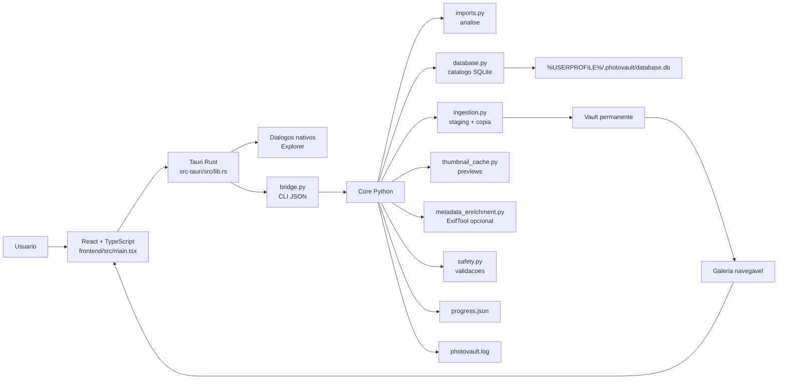

# PhotoVault

PhotoVault e um app desktop para transformar pastas soltas de fotos e videos em uma galeria permanente, catalogada e auditavel.

O foco atual nao e apenas copiar arquivos. O app cria um vault fixo, registra imports no SQLite, deduplica por identidade de midia, gera previews, instrumenta a copia e monta um cockpit para entender a galeria por tempo, formato, tamanho, decisao, dispositivo e metadados.

## Estado Atual

O fluxo funcional cobre:

- configurar uma pasta de vault permanente;
- selecionar uma origem com dialogo nativo do Windows;
- validar caminhos para evitar vault dentro da origem, origem dentro do vault e resets perigosos;
- analisar novos arquivos, duplicados, conhecidos no vault e erros de metadados;
- revisar decisoes por grupos acionaveis antes de copiar;
- copiar com staging, verificacao por tamanho e metricas de tempo/MB/s;
- registrar operacoes, instancias fisicas, imports e eventos de auditoria em SQLite;
- gerar thumbnails versionados de fotos, RAW suportados e frames de video para o painel de detalhe;
- enriquecer metadados com ExifTool opcional instalado no sistema;
- navegar pela galeria em modo Explorer textual, com filtros por texto, tipo, ano, mes, extensao, tamanho, dispositivo, camera, lente e problemas;
- buscar no catalogo usando FTS5 do SQLite quando ha texto de busca;
- renderizar a lista Explorer da galeria em lotes incrementais para manter a UI responsiva;
- registrar tags e notas de curadoria por asset;
- acompanhar saude da galeria em minibar clicavel, imports retomaveis e insights deterministicas no Cockpit;
- abrir ou localizar arquivos no Explorer;
- visualizar Cockpit com composicao da galeria, storage disponivel, economia por duplicatas, importacoes recentes, timeline real, facetas e sinais operacionais;
- diagnosticar ambiente local: Python, Node/npm, Cargo, ffmpeg, ffprobe, ExifTool e paths do app;
- acompanhar progresso e logs em `%USERPROFILE%\.photovault`.

## Como Rodar

Build debug atual:

```text
frontend\src-tauri\target\debug\app.exe
```

Build de release para teste em outro Windows:

```text
frontend\src-tauri\target\release\bundle\
```

O release usa `frontend\src-tauri\resources\photovault-bridge.exe` como bridge Python empacotada por PyInstaller e inclui `ffmpeg`/`ffprobe` como recursos do instalador de teste. ExifTool deve vir de uma instalacao externa confiavel no PATH; o projeto nao deve baixar ou embutir executavel suspeito. Veja `docs/RELEASE.md` para gerar os sidecars antes de compilar o instalador.

Para reconstruir:

```powershell
.\.venv\Scripts\python.exe -m pytest -q --basetemp=.pytest-tmp
cd frontend
npm.cmd run build
npx.cmd tauri build --debug --no-bundle
```

## Workflow Do Usuario

1. Abra o app Tauri.
2. Configure o vault da galeria.
3. Escolha a pasta de origem.
4. Rode a analise.
5. Revise os grupos de decisao.
6. Execute o plano.
7. Abra a Galeria em modo Explorer textual.
8. Selecione itens para ver preview e metadados no painel lateral.
9. Gere/atualize previews quando quiser enriquecer o painel de detalhe.
10. Use o Cockpit para entender volume, formatos, timeline, dispositivos, saude e riscos.
11. Rode enriquecimento de metadados quando ExifTool estiver disponivel.

## Arquitetura Em Uma Tela



Documentacao detalhada:

- [Arquitetura e contratos](docs/ARCHITECTURE.md)
- [Roadmap e melhorias propostas](docs/ROADMAP.md)
- [Checklist de release](docs/RELEASE.md)

## Mapa Do Codigo

```text
PhotoVault/
  bridge.py                         # contrato JSON entre Tauri e core Python
  core/
    database.py                     # schema SQLite, catalogo, facetas e processamento
    imports.py                      # analise de origem e plano inicial de importacao
    ingestion.py                    # execucao de planos, staging, verificacao e metricas
    identity.py                     # identidade por hash/metadados e score de qualidade
    metadata.py                     # extractors internos: exifread, Pillow, hachoir/ffprobe
    metadata_enrichment.py          # enriquecimento retroativo com ExifTool opcional
    runtime_tools.py                # descoberta de ffmpeg, ffprobe, perl e exiftool
    safety.py                       # validacoes de caminho e reset
    thumbnail_cache.py              # cache versionado de previews
    vault.py                        # paths canonicos do vault
    organizer.py                    # fluxo antigo/auxiliar ainda coberto por testes
    scanner.py                      # scan generico ainda coberto por testes
    inventory.py                    # inventario de fontes ainda coberto por testes
  frontend/
    src/main.tsx                    # app React, cockpit, galeria, imports, logs
    src/galleryFilters.ts           # filtros e normalizacoes da galeria
    src/styles.css                  # UI desktop
    src-tauri/src/lib.rs            # comandos nativos e execucao da bridge Python
  tests/                            # suite Python
  frontend/tests/                   # testes TypeScript de filtros
```

## Contrato Bridge

O frontend chama `invoke("bridge", { command, payload })`. O Tauri executa `.venv\Scripts\python.exe bridge.py <command>`, envia o payload por stdin e espera JSON no stdout.

Comandos ativos:

| Comando | Papel |
|---|---|
| `state` | Carrega vault, imports, resumo da galeria, disco, progresso e logs. |
| `set_vault` | Salva nome, caminho e padrao de organizacao do vault. |
| `analyze_import` | Analisa uma origem, cria import, arquivos e plano. |
| `import_insights` | Retorna grupos de decisao do import selecionado. |
| `update_decision_group` | Persiste decisao em lote por motivo. |
| `execute_import` | Executa o plano de ingestao com staging e metricas. |
| `gallery` | Lista itens, facetas, timeline, totais e capacidades da galeria; opcionalmente gera thumbnails. |
| `search_gallery` | Busca itens no catalogo via FTS5/SQLite. |
| `enrich_metadata` | Roda enriquecimento retroativo via ExifTool quando disponivel. |
| `health` | Retorna saude operacional, imports retomaveis, jobs e insights. |
| `catalog` | Retorna tags e notas de um asset. |
| `update_tags` | Atualiza tags manuais de um asset. |
| `add_note` | Adiciona nota de curadoria a um asset. |
| `progress` | Retorna progresso atual e metricas de jobs longos. |
| `logs` | Retorna tail do log local. |
| `diagnostics` | Retorna prontidao do ambiente local e ferramentas opcionais. |
| `reset_all` | Limpa estado local do app sem apagar a galeria fisica. |

## Catalogo Perene

O banco e tratado como catalogo, nao apenas cache de operacao.

Tabelas centrais:

| Tabela | Papel |
|---|---|
| `vaults` | Vaults configurados. |
| `assets` | Midias unicas por SHA-256. |
| `asset_instances` | Ocorrencias fisicas de assets em origens ou destino. |
| `imports` | Ciclos de importacao. |
| `import_files` | Arquivos analisados, decisao e motivo. |
| `ingest_plans` | Planos executaveis. |
| `ingest_operations` | Operacoes individuais de copiar/ignorar. |
| `metadata_extractions` | Metadados brutos e proveniencia por extractor. |
| `asset_processing_state` | Fila/estado de processadores como ExifTool. |
| `catalog_search` | Indice FTS5 para busca textual futura. |
| `catalog_tags` | Tags do catalogo. |
| `asset_tags` | Relacao de tags com assets. |
| `catalog_notes` | Notas humanas ou derivadas por IA/agente. |
| `audit_events` | Eventos de auditoria. |

Essa base prepara o app para consultas ricas e um agente de insights no futuro: perguntas sobre periodos, formatos, cameras, itens sem data, videos pesados, duplicatas, tags, notas e curadoria.

## Dados Locais

```text
%USERPROFILE%\.photovault\
  database.db
  progress.json
  photovault.log
  thumbs\                         # cache versionado de previews
```

O reset local do app limpa o estado do PhotoVault, mas nao apaga a galeria fisica do vault.

## Dependencias

- Windows 10/11
- Python 3.12+
- Node.js
- Rust/Cargo
- Visual Studio Build Tools com toolchain C++ para Tauri
- ExifTool opcional; se usado, deve vir de uma instalacao externa confiavel no PATH

Python:

```powershell
python -m venv .venv
.\.venv\Scripts\activate
pip install -r requirements.txt
pip install -r requirements-dev.txt
```

Frontend:

```powershell
cd frontend
npm install
```

## Comandos Uteis

Testes Python:

```powershell
.\.venv\Scripts\python.exe -m pytest -q --basetemp=.pytest-tmp
```

Teste TypeScript dos filtros:

```powershell
cd frontend
npm.cmd run test:filters
```

Build frontend:

```powershell
cd frontend
npm.cmd run build
```

Checagem Rust:

```powershell
cd frontend\src-tauri
cargo check
```

Build desktop debug:

```powershell
cd frontend
npx.cmd tauri build --debug --no-bundle
```

## Testes Cobertos

A suite atual cobre:

- contrato de galeria da bridge;
- schema/catalogo SQLite;
- deduplicacao;
- classificacao de dispositivos;
- insights da galeria;
- analise e execucao de imports;
- ingestao com staging, duplicatas e capacidade de disco;
- enriquecimento com ExifTool opcional;
- organizador/scanner/inventory legados;
- filtros TypeScript da galeria.

## Decisoes Tecnicas Recentes

- Tauri/Rust assumiu dialogo de pasta e abrir/localizar no Explorer.
- A bridge Python ficou responsavel pelo contrato JSON e core de dominio.
- `tkinter`, `customtkinter`, `matplotlib`, GUI Python antiga e build PyInstaller foram removidos do caminho ativo.
- Dependencias frontend foram pinadas no `package.json`.
- `imageio-ffmpeg` foi adicionado para previews de video.
- `pytest.ini` usa cache local do projeto.
- `scanner.py` passou a usar `os.walk` e relatorio estruturado.
- Validacoes de caminho evitam operacoes perigosas.
- O caminho ativo do app desktop e exclusivamente Tauri/React com bridge Python.
- O enriquecimento retroativo com ExifTool e opcional e nao bloqueante.
- Binarios embutidos do ExifTool foram removidos do pacote Tauri.
- O Cockpit passou a mostrar diagnostico de ambiente via bridge.
- A galeria passou a usar busca FTS5 para texto, visualizacao Explorer incremental, tags/notas e painel de saude.
- A grade visual de cards foi substituida por lista Explorer textual; previews ficam no painel lateral sob selecao.
- O cache de thumbnails passou a ser versionado para evitar reaproveitar previews antigos com regra visual defasada.
- O Cockpit foi remodelado com minibar de saude, quadrante "Na Galeria", timeline real, organizacao do acervo e economia acumulada por duplicatas evitadas.

## Pendencias Conhecidas

- O catalogo ja tem base para IA/agente, mas ainda nao chama modelos externos.
- As facetas de camera dependem de metadados realmente extraidos; imports antigos podem aparecer como `Desconhecido` ate receberem enriquecimento.
- A lista Explorer da galeria ja renderiza em lotes, mas a consulta ainda carrega um limite alto em memoria; paginacao SQLite continua como prioridade.
- Jobs longos ainda rodam como chamadas bridge sincrona disparadas pelo Tauri; ja existe base de `background_jobs`, mas workers retomaveis completos ainda sao evolucao futura.

## Licenca

MIT.
