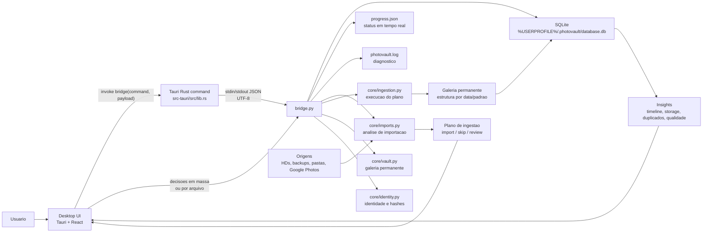
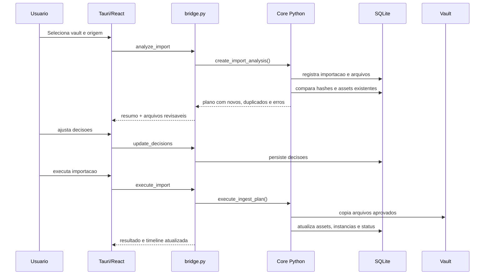

# PhotoVault

PhotoVault e uma ferramenta desktop para construir uma galeria permanente de fotos e videos a partir de ciclos controlados de importacao.

A ideia central nao e mais "comparar duas pastas e executar uma vez". O app trabalha com um vault fixo, um banco local e uma timeline de importacoes. Cada nova origem passa por analise, deteccao de duplicidade, decisao de importacao e execucao auditavel.

## Objetivo

Criar uma galeria confiavel e sustentavel para grandes volumes de midia vindos de HDs internos/externos, backups, downloads do Google Photos e outras fontes.

O PhotoVault busca responder:

| Pergunta | Como o app ajuda |
|---|---|
| O que ja existe na minha galeria? | Mantem indice local de assets, instancias, hashes e metadados. |
| Essa pasta nova tem duplicados? | Compara arquivos por tamanho, hash parcial, hash completo e identidade de midia. |
| O que devo importar, revisar ou ignorar? | Cria um plano de ingestao com decisoes editaveis. |
| Quanto isso vai ocupar? | Exibe graficos e metricas de storage antes da execucao. |
| O que aconteceu em cada importacao? | Guarda timeline, status, arquivos manipulados, erros e resultados. |

## Workflow atual

1. Configure uma galeria permanente, tambem chamada de vault.
2. Escolha uma pasta de origem para importar.
3. Rode a analise.
4. Revise o resumo textual, duplicados, novos arquivos, erros e impacto em disco.
5. Ajuste decisoes em massa ou por arquivo: importar, ignorar ou revisar.
6. Execute a importacao.
7. Acompanhe a timeline e use o historico para continuar a organizacao ao longo do tempo.

## Interface

A interface principal atual e desktop com Tauri + React, usando o core Python existente por meio de uma bridge local.

Principais areas:

| Area | Funcao |
|---|---|
| Vault | Define a pasta permanente da galeria e o padrao de organizacao. |
| Nova importacao | Seleciona a origem, analisa arquivos e monta o plano. |
| Timeline | Mostra historico de importacoes, status e progresso. |
| Revisao | Lista arquivos detectados, destino previsto, motivo e decisao. |
| Insights | Exibe indicadores, graficos, uso de disco e composicao da galeria. |
| Logs | Registra operacoes da bridge e erros em `%USERPROFILE%\.photovault\photovault.log`. |

## Diagrama do app



## Pipeline de importacao



## Arquitetura

| Camada | Tecnologia | Responsabilidade |
|---|---|---|
| Desktop | Tauri 2 + Rust | Janela nativa, empacotamento e chamada segura da bridge. |
| Frontend | React + TypeScript + Vite | Experiencia visual, timeline, graficos, decisoes e feedback. |
| Bridge | Python CLI JSON | Contrato entre UI e core Python. |
| Core | Python | Analise, hashing, metadados, planos de importacao e ingestao. |
| Persistencia | SQLite | Vaults, assets, instancias, imports, planos, operacoes e auditoria. |
| Logs | Python logging | Diagnostico local em `%USERPROFILE%\.photovault`. |

## Estrutura importante

```text
PhotoVault/
  bridge.py                         # API local JSON usada pelo Tauri
  core/
    database.py                     # schema SQLite e repositorios
    identity.py                     # hashes e identidade de arquivo
    imports.py                      # analise de uma origem
    ingestion.py                    # execucao do plano aprovado
    vault.py                        # configuracao da galeria permanente
    metadata.py                     # EXIF/video metadata
    patterns.py                     # padroes de destino
  frontend/
    src/main.tsx                    # UI React
    src/styles.css                  # visual desktop
    src-tauri/src/lib.rs            # comando Rust que chama bridge.py
    src-tauri/tauri.conf.json       # configuracao Tauri
  tests/
    test_imports.py
    test_ingestion.py
  utils/
    logging.py                      # arquivo de log do app
```

## Dados locais

Por padrao, os dados de runtime ficam em:

```text
%USERPROFILE%\.photovault\
```

Arquivos principais:

| Arquivo | Funcao |
|---|---|
| `database.db` | Banco SQLite local. |
| `progress.json` | Estado do processo atual para feedback da UI. |
| `photovault.log` | Log de diagnostico. |

Para testes destrutivos, essa pasta pode ser limpa manualmente ou pela acao de reset do app.

## Banco de dados

Tabelas principais:

| Tabela | Conteudo |
|---|---|
| `vaults` | Galerias configuradas. |
| `assets` | Midias unicas conhecidas pela galeria. |
| `asset_instances` | Ocorrencias fisicas de um asset em disco. |
| `imports` | Historico de ciclos de importacao. |
| `import_files` | Arquivos detectados em cada importacao e suas decisoes. |
| `ingest_plans` | Planos gerados para execucao. |
| `ingest_operations` | Operacoes de copiar/ignorar/revisar. |
| `audit_events` | Eventos relevantes para auditoria. |

## Requisitos de desenvolvimento

- Windows 10/11
- Python 3.12+
- Node.js
- Rust/Cargo
- Visual Studio Build Tools com toolchain C++ para Tauri

## Setup Python

```powershell
python -m venv .venv
.\.venv\Scripts\activate
pip install -r requirements.txt
pip install -r requirements-dev.txt
```

## Setup frontend

```powershell
cd frontend
npm install
```

## Rodar testes

```powershell
.\.venv\Scripts\python.exe -m pytest -q
```

## Rodar frontend web em desenvolvimento

```powershell
cd frontend
npm run dev
```

## Build da UI

```powershell
cd frontend
npm run build
```

## Build desktop Tauri

```powershell
cd frontend
npx tauri build --debug
```

O executavel debug fica em:

```text
frontend\src-tauri\target\debug\app.exe
```

Os instaladores debug ficam em:

```text
frontend\src-tauri\target\debug\bundle\
```

## App legado

O projeto ainda contem a interface antiga em CustomTkinter (`main.py` e `gui/`). Ela foi mantida por compatibilidade e como referencia de funcionalidades, mas o caminho principal da nova experiencia e `frontend/` com Tauri + React.

## Formatos suportados

Fotos:

```text
.jpg .jpeg .png .gif .bmp .tiff .tif .webp .heic .heif .raw .cr2 .nef .arw .dng .orf .rw2 .pef
```

Videos:

```text
.mp4 .mov .avi .mkv .wmv .flv .webm .m4v .3gp .mts .m2ts
```

## Estado atual

A versao atual e uma base funcional para testar o ciclo de galeria permanente:

- configurar vault;
- analisar origem;
- detectar novos arquivos, duplicados e erros;
- revisar decisoes;
- executar importacao;
- acompanhar timeline, progresso, logs e storage.

Proximas evolucoes naturais:

- previews visuais sob demanda por arquivo;
- filtros rapidos clicaveis por motivo/status/dispositivo/data;
- insights mais fortes de qualidade, dispositivo e periodos;
- integracao completa com Google Photos no fluxo novo;
- acoes em massa mais ricas para limpeza e revisao.

## Licenca

MIT License. Veja [LICENSE](LICENSE) para detalhes.
