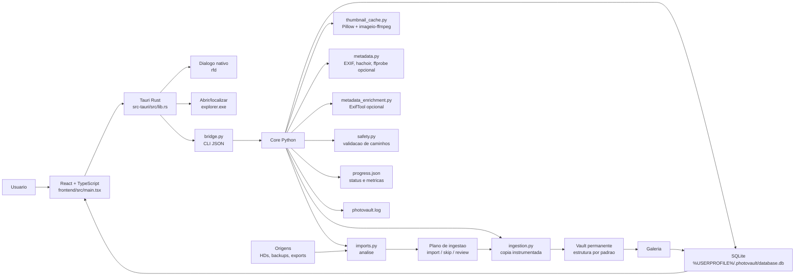
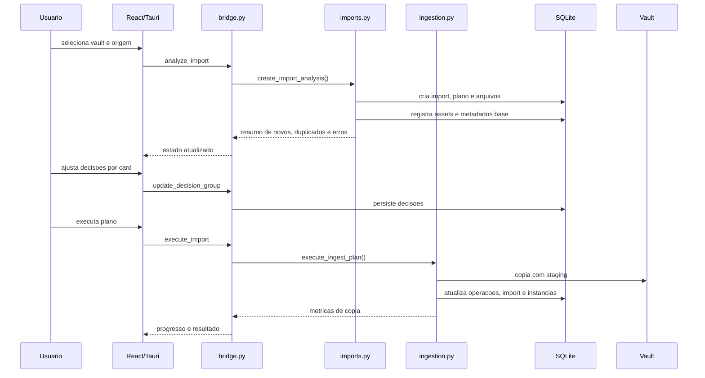

# PhotoVault

PhotoVault e um app desktop para transformar pastas soltas de fotos e videos em uma galeria permanente, catalogada e auditavel.

O foco atual nao e apenas copiar arquivos. O app cria um vault fixo, registra imports no SQLite, deduplica por identidade de midia, gera previews, instrumenta a copia e monta um cockpit para entender a galeria por tempo, formato, tamanho, decisao e metadados.

## Estado Atual

O fluxo funcional ja cobre:

- configurar uma pasta de vault permanente;
- selecionar uma origem com dialogo nativo do Windows;
- analisar novos arquivos, duplicados e erros;
- revisar decisoes por grupos acionaveis;
- copiar com staging, verificacao por tamanho e metricas de tempo/MB/s;
- gerar thumbnails de fotos, RAW suportados e frames de video;
- enriquecer metadados com ExifTool opcional instalado no sistema;
- navegar pela galeria com filtros por tipo, ano, mes, extensao, tamanho e problemas;
- abrir ou localizar arquivos no Explorer;
- visualizar cockpit com composicao da galeria, storage, imports recentes e sinais operacionais;
- preservar estado em banco local e logs em `%USERPROFILE%\.photovault`.

## Como Testar

Build debug atual:

```text
frontend\src-tauri\target\debug\app.exe
```

Para reconstruir:

```powershell
.\.venv\Scripts\python.exe -m pytest -q --basetemp=.pytest-tmp
cd frontend
npm.cmd run build
npx.cmd tauri build --debug --no-bundle
```

## Workflow

1. Abra o app Tauri.
2. Configure o vault da galeria.
3. Escolha a pasta de origem.
4. Rode a analise.
5. Revise os cards de decisao.
6. Execute o plano.
7. Abra a Galeria e gere/atualize previews.
8. Use o Cockpit para entender volume, formatos, timeline, dispositivos e riscos.

## Arquitetura Geral



## Pipeline de Importacao



## Catalogo Perene

O banco passou a ser tratado como catalogo, nao apenas cache de operacao.

Tabelas centrais:

| Tabela | Papel |
|---|---|
| `vaults` | Vaults configurados. |
| `assets` | Midias unicas por SHA-256. |
| `asset_instances` | Ocorrencias fisicas de assets em origens ou destino. |
| `imports` | Ciclos de importacao. |
| `import_files` | Arquivos analisados, decisao e motivo. |
| `ingest_plans` | Planos executaveis. |
| `ingest_operations` | Operacoes individuais de copiar/ignorar. |
| `metadata_extractions` | Metadados brutos e proveniencia por extractor. |
| `catalog_search` | Indice FTS5 para busca textual futura. |
| `catalog_tags` | Tags do catalogo. |
| `asset_tags` | Relacao de tags com assets. |
| `catalog_notes` | Notas humanas ou derivadas por IA/agente. |
| `audit_events` | Eventos de auditoria. |

Essa base prepara o app para consultas ricas e um agente de insights no futuro: perguntas sobre periodos, formatos, cameras, itens sem data, videos pesados, duplicatas, tags e curadoria.

## Thumbnails e Video

Fotos e RAW suportados usam Pillow.

Videos usam `imageio-ffmpeg`, que entrega um binario local de `ffmpeg` dentro do ambiente Python. Assim o app nao depende de `ffmpeg` estar instalado no PATH do Windows para gerar frames.

O cache fica em:

```text
%USERPROFILE%\.photovault\thumbs
```

Se o cache for apagado, o app recria os previews sob demanda pelo botao `Previews`.

## Metadados Ricos

O PhotoVault nao embarca mais binarios do ExifTool. Por seguranca, o enriquecimento rico so usa `exiftool` ou `exiftool.exe` quando a ferramenta esta instalada no sistema e disponivel no PATH.

Quando presente, o botao `Enriquecer` no Cockpit ou `Metadados` na Galeria roda um enriquecimento retroativo dos assets ja importados. O processo salva o JSON bruto em `metadata_extractions`, promove campos normalizados para o catalogo e atualiza a busca/facetas.

Campos aproveitados incluem:

- camera, modelo, lente e software;
- data original/criacao;
- dimensoes, duracao, codec, bitrate e frame rate quando presentes;
- GPS quando presente no arquivo;
- tipo de dispositivo normalizado.

Sem ExifTool, o app continua funcionando com os extractors internos (`exifread`, Pillow, hachoir e ffprobe quando disponivel) e mostra o status `Ausente` na interface.

## Metricas de Copia

A execucao registra:

- arquivos copiados, ignorados e com erro;
- bytes importados;
- MB/s medio;
- MB/s do ultimo arquivo;
- tempo de copia, verificacao, banco e finalizacao;
- maior arquivo;
- arquivo mais lento.

Essas metricas aparecem no progresso e ficam nos logs/auditoria para comparacao entre execucoes.

## Estrutura do Projeto

```text
PhotoVault/
  bridge.py
  core/
    database.py
    imports.py
    ingestion.py
    identity.py
    metadata.py
    metadata_enrichment.py
    runtime_tools.py
    safety.py
    scanner.py
    thumbnail_cache.py
    vault.py
  frontend/
    src/main.tsx
    src/styles.css
    src-tauri/
      src/lib.rs
      Cargo.toml
      tauri.conf.json
  tests/
  utils/
```

## Dados Locais

```text
%USERPROFILE%\.photovault\
  database.db
  progress.json
  photovault.log
  thumbs\
```

O reset local do app limpa o estado do PhotoVault, mas nao apaga a galeria fisica do vault.

## Requisitos

- Windows 10/11
- Python 3.12+
- Node.js
- Rust/Cargo
- Visual Studio Build Tools com toolchain C++ para Tauri
- ExifTool e opcional; se usado, deve vir de uma instalacao externa confiavel no PATH

## Setup

Python:

```powershell
python -m venv .venv
.\.venv\Scripts\activate
pip install -r requirements.txt
pip install -r requirements-dev.txt
```

Frontend:

```powershell
cd frontend
npm install
```

## Comandos Uteis

Testes:

```powershell
.\.venv\Scripts\python.exe -m pytest -q --basetemp=.pytest-tmp
```

Build frontend:

```powershell
cd frontend
npm.cmd run build
```

Checagem Rust:

```powershell
cd frontend\src-tauri
cargo check
```

Build desktop debug:

```powershell
cd frontend
npx.cmd tauri build --debug --no-bundle
```

## Decisoes Tecnicas Recentes

- Tauri/Rust assumiu dialogo de pasta e abrir/localizar no Explorer.
- A bridge Python ficou responsavel pelo contrato JSON e core de dominio.
- `tkinter`, `customtkinter`, `matplotlib`, a GUI Python antiga e o build PyInstaller foram removidos do projeto ativo.
- Dependencias frontend foram pinadas no `package.json`.
- `imageio-ffmpeg` foi adicionado para previews de video.
- `pytest.ini` usa cache local do projeto.
- `scanner.py` passou a usar `os.walk` e relatorio estruturado.
- Validacoes de caminho evitam importar vault dentro da origem, origem dentro do vault e resets perigosos.
- O caminho ativo do app desktop e exclusivamente Tauri/React com bridge Python.
- O enriquecimento retroativo com ExifTool foi mantido como capacidade opcional e nao bloqueante.
- Binarios embutidos do ExifTool foram removidos do pacote Tauri; o app nao injeta mais `PHOTOVAULT_EXIFTOOL` na bridge.

## Pendencias Conhecidas

- O catalogo ja tem base para IA/agente, mas ainda nao chama modelos externos.
- As facetas de camera dependem de metadados realmente extraidos; imports antigos podem aparecer como `Desconhecido` ate receberem enriquecimento com ExifTool ou outro extractor rico.

## Licenca

MIT.
