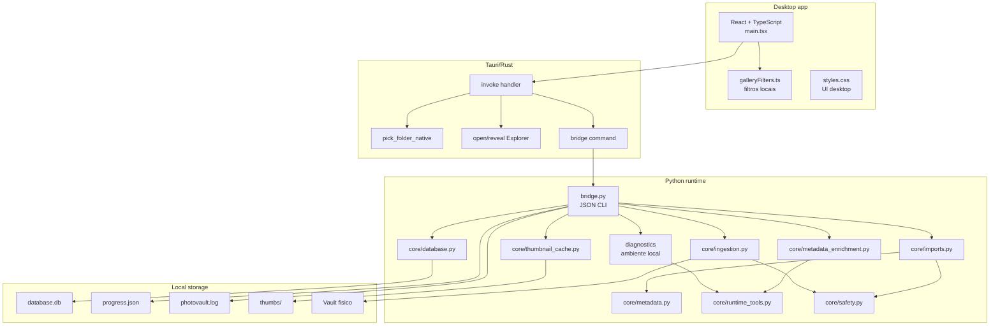
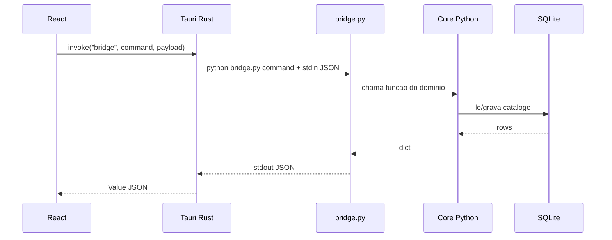
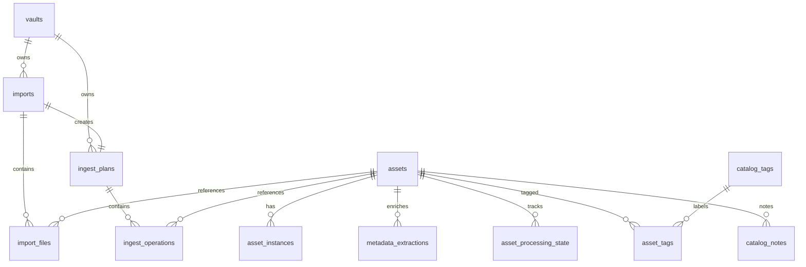
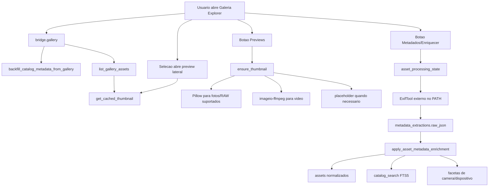

# Arquitetura Do PhotoVault

Este documento descreve o estado atual do projeto em julho de 2026. O caminho ativo do produto e o app desktop Tauri/React chamando uma bridge Python, com persistencia em SQLite e arquivos locais no vault configurado pelo usuario.

## Visao Top-Down



## Runtime E Processo

O frontend chama:

```ts
invoke("bridge", { command, payload })
```

O comando Tauri `bridge` executa:

```text
.venv\Scripts\python.exe bridge.py <command>
```

O payload entra via stdin e a resposta sai como JSON em stdout. Erros da bridge retornam `{ ok: false, error }` ou viram erro do comando Tauri.



## Comandos Da Bridge

| Comando | Entrada principal | Saida principal |
|---|---|---|
| `state` | `{}` | `BackendState`: vault, imports, gallery summary, disk, progress, logPath. |
| `set_vault` | `{ name, path, pattern }` | vault salvo. |
| `analyze_import` | `{ sourcePath, vaultPath?, pattern?, mode?, name? }` | cria import/plano e retorna estado atualizado. |
| `import_insights` | `{ importId }` | grupos por motivo, midia e status. |
| `update_decision_group` | `{ importId, reason, decision }` | quantidade atualizada e insights. |
| `execute_import` | `{ planId, verifyMode }` | resultado de ingestao e metricas. |
| `gallery` | `{ limit, offset, filter, sort, ensureThumbnails }` | itens, pagina (padrao 240, teto 1000), total filtrado, totais, facetas, capacidades e timings. |
| `search_gallery` | `{ query, limit, offset, filter, sort, ensureThumbnails? }` | resultados por FTS5/SQLite com o mesmo formato de `GalleryState`. |
| `enrich_metadata` | `{ limit }` | resultado do ExifTool e estado atualizado. |
| `health` | `{}` | saude operacional, imports retomaveis, jobs e insights deterministicas. |
| `catalog` | `{ assetId }` | tags e notas de curadoria do asset. |
| `update_tags` | `{ assetId, tags }` | substitui tags manuais do asset. |
| `add_note` | `{ assetId, body }` | adiciona nota de curadoria. |
| `job_control` | `{ jobId, action }` | pausa, retoma ou cancela jobs de importacao. |
| `progress` | `{}` | progresso atual e caminho do log. |
| `logs` | `{ lines }` | tail do log local. |
| `diagnostics` | `{}` | status de Python, Node/npm, Cargo, ffmpeg, ffprobe, ExifTool e paths locais. |
| `reset_all` | `{ confirmReset: true }` | limpa banco/cache/progresso locais e retorna estado. |

O frontend nao consulta progresso via bridge Python durante polling. O comando Tauri `progress_snapshot_native` le `%USERPROFILE%\.photovault\progress.json` diretamente, evitando criar processos `photovault-bridge` a cada leitura de status.

## Pipeline De Importacao

```mermaid
flowchart LR
    Source["Pasta origem"] --> Validate["validate_import_paths"]
    Validate --> Scan["create_import_analysis"]
    Scan --> Identity["identify_media<br/>sha256 + metadados"]
    Identity --> Assets["assets + asset_instances origem"]
    Assets --> Decisions["import_files<br/>decision/reason"]
    Decisions --> Plan["ingest_plans + ingest_operations"]
    Plan --> Review["UI revisa grupos"]
    Review --> Execute["execute_ingest_plan"]
    Execute --> Staging["copia para staging"]
    Staging --> Verify["verifica tamanho<br/>verifyMode=size"]
    Verify --> Destination["asset_instances destino"]
    Destination --> Audit["audit_events + progress"]
    Destination --> Vault["Vault permanente"]
```



### Motivos De Decisao

| Motivo | Decisao padrao | Significado |
|---|---|---|
| `new_asset` | `import` | Midia ainda nao existe no vault. |
| `exact_duplicate_in_plan` | `skip` | Mesmo arquivo aparece mais de uma vez na origem/plano. |
| `exact_duplicate_in_vault` | `skip` | Mesmo SHA-256 ja existe no destino. |
| `known_asset_in_vault` | `skip` | Asset conhecido ja possui instancia no vault. |
| `metadata_error` | `review` | Falha ao identificar/analisar arquivo. |

## Catalogo SQLite



### Tabelas Ativas

| Grupo | Tabelas |
|---|---|
| Vault/catalogo | `vaults`, `assets`, `asset_instances` |
| Importacao | `imports`, `import_files`, `ingest_plans`, `ingest_operations` |
| Metadados | `metadata_extractions`, `asset_processing_state`, `catalog_search` |
| Curadoria futura | `catalog_tags`, `asset_tags`, `catalog_notes` |
| Auditoria | `audit_events` |
| Legado/compatibilidade | `files`, `sources`, `scan_jobs`, `sessions`, `destination_index` |

## Galeria Explorer E Facetas

`bridge.gallery` aceita `limit`, `offset`, `filter`, `sort` e `ensureThumbnails`, e monta:

- totais: total, fotos, videos, bytes por tipo, economia por duplicatas, sem data, primeira/ultima data;
- facetas persistidas: midia, anos, meses, timeline cronologica, extensoes, devices, deviceTypes, cameras;
- itens: path, thumbnail, previewStatus, mediaType, extensao, tamanho, data, resolucao, dispositivo, camera, lente, software, GPS, codec, bitrate, exposicao e origem dos metadados;
- capacidades: ffmpeg, ExifTool, versao/status;
- processamento: resumo da fila de ExifTool.

No frontend, `galleryFilters.ts` ainda concentra normalizadores e helpers de faceta, mas os filtros principais por query, midia, extensao, ano, mes, tamanho, problema, deviceType, device, camera e lens sao enviados para a bridge e aplicados no SQLite.

A Galeria usa uma visualizacao Explorer textual: cada linha mostra nome, tipo/extensao/resolucao, data, dispositivo, tamanho e badges de preview/metadados. O preview visual fica no inspetor lateral quando um item e selecionado. A lista renderiza paginas de 240 itens, usando `page.limit`, `page.offset`, `page.count`, `page.hasMore` e `filteredTotal`. A busca textual usa `catalog_search` FTS5 com fallback `LIKE`.

Tags e notas sao salvas em `catalog_tags`, `asset_tags` e `catalog_notes`, e entram no indice textual por `refresh_catalog_search_conn`.

## Pipeline De Previews E Metadados



## Frontend

Views principais em `frontend/src/main.tsx`:

| View | Papel |
|---|---|
| `cockpit` | Visao operacional da galeria, imports, storage, facetas e sinais. |
| `gallery` | Lista Explorer textual, filtros, preview lateral, metadados e acoes de abrir/localizar. |
| `import` | Configura vault/origem, analisa e executa plano. |
| `reviews` | Revisao de grupos de decisao por motivo. |
| `logs` | Tail de logs locais. |

O Cockpit tambem mostra um painel de ambiente alimentado por `diagnostics`, incluindo requisitos obrigatorios de desenvolvimento e ferramentas opcionais para previews/metadados.
O Cockpit mostra uma secao propria de Saude da Galeria: score operacional, metadados pendentes, itens sem data, erros recentes, dependencias, espaco livre, ferramentas disponiveis, jobs persistentes, imports retomaveis e insights deterministicas sem modelo externo. A composicao "Na Galeria" agrupa fotos/videos, periodo, importado, duplicatas evitadas e organizacao do acervo.

Estados principais ficam tipados em `frontend/src/contracts.ts`:

- `BackendState`: estado inicial agregado;
- `GalleryState`: itens, totais, facetas e capacidades;
- `ImportInsights`: grupos acionaveis de decisao;
- `ProgressInfo`: progresso de analise, copia e enriquecimento;
- `LogState`: caminho e linhas do log.

## Modulos Ativos E Auxiliares

### Ativos No Fluxo Tauri

- `bridge.py`
- `core/database.py`
- `core/imports.py`
- `core/ingestion.py`
- `core/identity.py`
- `core/metadata.py`
- `core/metadata_enrichment.py`
- `core/runtime_tools.py`
- `core/safety.py`
- `core/thumbnail_cache.py`
- `core/vault.py`

### Auxiliares/Legados Ainda Testados

- `core/organizer.py`: fluxo antigo de organizacao/copia.
- `core/scanner.py`: scan generico com relatorio estruturado.
- `core/inventory.py`: inventario incremental de fontes.
- `core/gallery_insights.py`: sumarizacao de itens fora do fluxo principal atual.
- `integrations/google_photos.py`: ponto inicial de integracao externa.

## Observabilidade

Arquivos locais:

```text
%USERPROFILE%\.photovault\
  database.db
  progress.json
  photovault.log
  thumbs\                         # cache versionado de previews
```

Metricas de copia registradas:

- arquivos copiados, ignorados e com erro;
- bytes importados;
- MB/s medio e do ultimo arquivo;
- tempo de copia, verificacao, banco e finalizacao;
- maior arquivo;
- arquivo mais lento;
- ETA durante execucao.

## Testes

Comandos:

```powershell
.\.venv\Scripts\python.exe -m pytest -q --basetemp=.pytest-tmp
cd frontend
npm.cmd run test:filters
```

Cobertura funcional atual:

- bridge/gallery/state;
- schema e catalogo SQLite;
- imports e ingestao;
- deduplicacao e identidade;
- dispositivo/camera/metadados;
- runtime tools para ffmpeg/ExifTool;
- thumbnails;
- scanner/inventory/organizer legados;
- filtros TypeScript.
